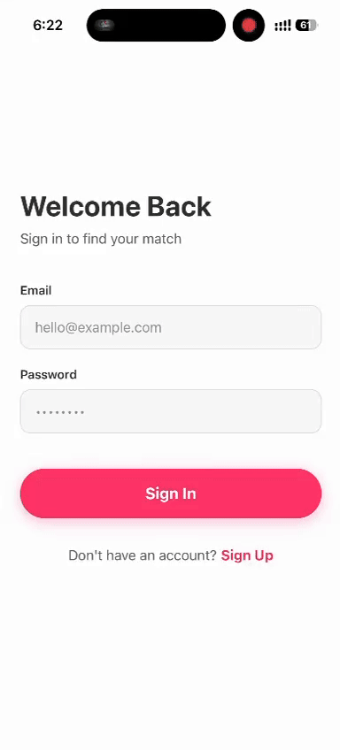
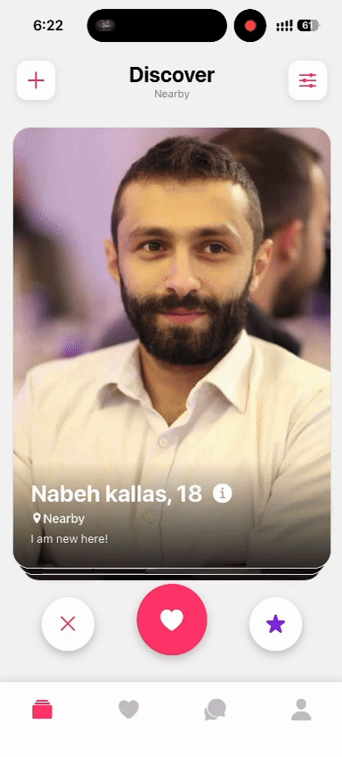
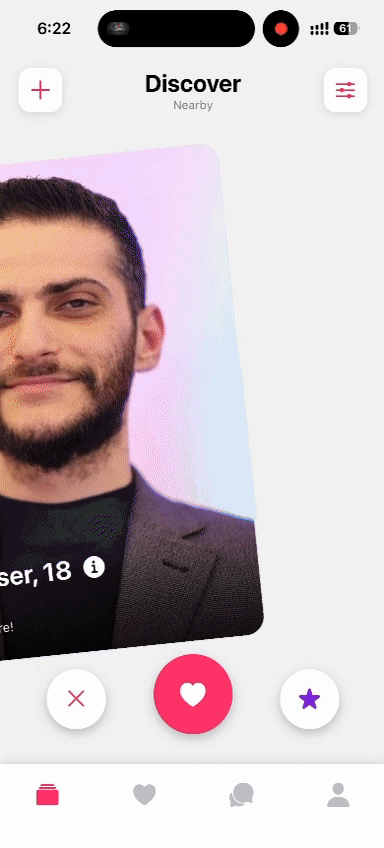

💘 <b>Cross-Platform Dating Application</b>

A high-performance, full-stack mobile dating experience built with React Native Expo, Laravel, and Firebase.

     

📖 <b>About The Project</b>

This is a feature-rich dating application designed for performance and scalability. It combines the smooth cross-platform UI of React Native Expo with robust backend logic handled by Laravel, and leverages Firebase (Firestore, Auth) as the primary data store.

The architecture is designed for speed: while Laravel handles complex querying (like geospatial distance calculations), latency-sensitive features like real-time chat and media uploading bypass the intermediate server and connect directly to Firebase and Cloudinary from the client.

  
✨ <b>Key Features</b>
 
 
<ul>
<li>
🔐 Authentication:  
</li>
 Secure Sign In and Sign Up powered by Firebase Auth.
<li>
🔥 Interactive Feed:
</li>
 Smooth card-swipe interface (Left to Pass, Right to Like, Up to Super Like) using react-native-deck-swiper.
<li>
🎯 Advanced Discovery: 
</li>
Filter users based on distance radius, age range, and gender preferences via Laravel backend logic.
<li>
💬 Real-time Chat:
</li>
 Instant messaging capability using react-native-gifted-chat connected directly to Firestore for low latency.
<li>
📸 Stories & Media:
</li>
 Users can upload gallery images and post temporary "Stories" (viewable within chat), stored via Cloudinary.
<li>
🤝 Match Management:
</li>
 Match screen to review, accept, or cancel pending matches.
<li>
👤 Profile Hub:
</li>
 Comprehensive edit profile capabilities, gallery management, avatar changes, and in-app language switching.
<li>
🔎 User Details:
</li>
 Tap on any user profile in the feed to view detailed information.
 </ul>
  

 

 🏗️<b> Architecture & Technical Highlights</b>
 
 

The gRPC Performance Optimization Journey
One of the significant technical challenges during development was connecting Laravel to Google Cloud Firestore.
<ol>
<li>Initial Phase (REST): Initially, configuring the native gRPC engine faced roadblocks. To maintain development velocity, I utilized the mrshan library, enabling connection to Firestore via its REST API engine. This allowed feature development to continue smoothly.
</li>
<li>
Optimization Phase (gRPC): Post-feature completion, I revisited the infrastructure. I successfully installed the necessary gRPC certificates on the server environment and switched the Laravel connection from the REST client to the native firestoreClient.
</li>
<li>
Result: This migration to gRPC resulted in an approximate 10x performance optimization for backend data retrieval.
</li>
</ol>

 
 
<b>Hybrid Data Flow Strategy</b>
 
 
To ensure the best user experience, the app uses a hybrid connectivity approach:
<ul>

<li>Laravel Backend (Complex Logic): Axios requests—secured with injected Firebase Auth tokens in the headers—are sent to Laravel controllers. Laravel handles logic for discovering users within specific geospatial distances and demographic filters.
</li>
<li>
Direct-to-Firebase (High Performance): For latency-critical features like Authentication, Real-time Chat, and image uploads (via Cloudinary), the React Native client connects directly to Firebase/Cloudinary services, bypassing the backend bottleneck.
</li>
 

 
</ul>
🛠<b> Technical Stack</b>
 
 
<b>Frontend (Mobile)</b>
<ul>
<li><b>Framework:</b>  React Native (Expo SDK)</li>
 

<li><b>HTTP Client:</b> Axios (with token interceptors)</li>
 
<li><ul>
<b>Key Libraries:</b>
 
 
<li>react-native-deck-swiper (Feed UI)</li>

<li>react-native-gifted-chat (Messaging)</li>

<li>expo-image-picker (Media handling)</li>

<li>Firebase JS SDK</li></ul>
</ul>

<b>Backend & Database</b>
 

</ul>
</ul>
<ul>
<li><b>Server Framework</b>: Laravel (PHP)</li>

<li><b>Database</b>: Google Cloud Firestore (NoSQL)</li>

<li><b>Connection Engine</b>: gRPC (migrated from REST)</li>

<li><b>Media Storage</b>: Cloudinary</li>
</ul>

<b>🚀 Getting Started</b>

To set up this project locally, you need to configure both the frontend and backend environments.

Prerequisites
<ul>
<li>Node.js and npm/yarn</li>

<li>PHP and Composer</li>

<li>A Firebase Project (with Firestore and Auth enabled)</li>

<li>A Cloudinary Account</li>
</ul>
 
<ol>
<li> Backend Setup (Laravel)</li>
<ol>
<li>Navigate to the backend directory.</li>
<li>
Install PHP dependencies:
Bash
composer install</li>
<li>
Create your environment file:
</li>

Bash

cp .env.example .env
<li>
Crucial Step: Generate a service account private key JSON file from your Google Cloud Console for Firestore access. Place this file securely in your project structure.</li>
<li>
Update the .env file with the path to your certificate and your Firestore project ID, following the example format.</li>
<li>
Start the Laravel server:

Bash

php artisan serve</li></ol>
<li> Frontend Setup (React Native Expo)</li>
<ol>
<li>
Navigate to the frontend directory.
</li><li>
Install Node dependencies:
Bash
npm install
</li>
<li>
Create your environment file:

Bash

cp .env.example .env
</li>
<li>
Crucial Step: Populate the .env file with your Firebase configuration keys (API Key, Auth Domain, Project ID, etc.) and your Cloudinary credentials as shown in the example file.
</li>
<li>
Start the Expo development server:

Bash
npx expo start
</li>
<li>
Scan the QR code with your physical device (using Expo Go) or run on an emulator.</li>
</ol>

github for frontend commits: <a>https://github.com/nabehkallas/Dating-ReactNative</a></h>
 
github for backend commits: 
<a>https://github.com/nabehkallas/Dating-Laravel</a>

Important!!!!!!

<b>create a .env in frontend folder file and fill the variables just like in env.example file</b>

create /storage/firebase_credentials in the backend folder and create .env file like .env.example 

Eng.Nabeh kallas

erDiagram
  

    USERS {
        string uid PK
        string name
        string email
        string avatar
        geopoint location
        int age
        string gender
        string bio
        object preferences "min_age, max_age, gender_pref, radius"
    }

    SUB-COLLECTIONS under USERS/{uid}
    SWIPES {
        string target_user_id
        string type "left/right/super"
        timestamp created_at
    }

    RECEIVED_LIKES {
        string from_user_id
        string from_user_name
        timestamp created_at
    }

    MATCHES COLLECTION (Root)
    MATCHES ||--o{ MESSAGES : "sub-collection"
    MATCHES {
        string match_id PK
        array user_ids
        timestamp matched_at
        string last_message
    }

    MESSAGES sub-collection under MATCHES/{match_id}
    MESSAGES {
        string sender_id
        string text
        string image_url
        timestamp created_at
    }

    STORIES COLLECTION (Root)
    STORIES {
        string story_id PK
        string user_id FK
        string image_url
        string user_name
        string user_avatar
        timestamp created_at
        timestamp expires_at
    }
    
    